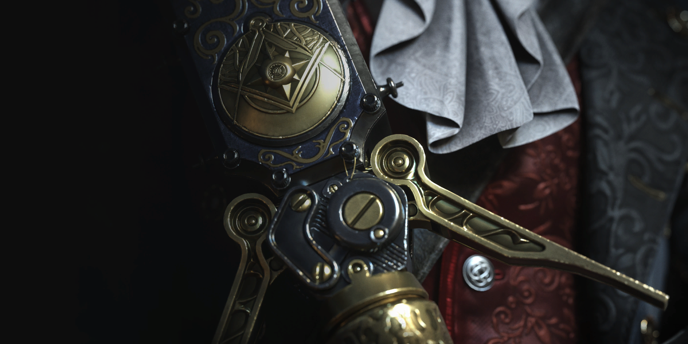

# 🎮 P의 거짓 모작 포트폴리오

## 📺 메인 이미지

## 📺 영상 데모

---

## 📝 기본적인 GIF

### 1. 재질별 충돌 파티클
| 재질별(철, 나무, 돌) 충돌 파티클 |
|----------|

---

### 2. 공격 캔슬
| 1타 공격 | 연속 공격 |
|----------|---------------|
|  |  |

---

### 3. 무기별 공격 보정 및 판정
| Saber | Rapier | Bayonet |
|-------|--------|---------|
|  |  |  |

---

### 4. 보스
| 1 Phase Boss 1 | 1 Phase Boss 2 |
|--------|--------|
|  |  |

| 2 Phase Boss 1 | 2 Phase Boss 2 |
|--------|--------|
|  |  |

