# 🎮 P의 거짓 (Lies of P) 모작 포트폴리오

# ⚔️ 프로젝트 개요

>GAS 기반 전투 아키텍처를 설계하고  
>Ability + Data 중심 확장 구조로 구현한 3D 액션 프로젝트

> Lies of P 전투 구조를 레퍼런스로,  
> 싱글 플레이 환경에서 전투·AI·데이터 흐름을 통합 설계했습니다.

• 개발 인원: 1인  
• 개발 기간: 2025.07.07 ~ 2025.09.21 (11주)  
• 개발 환경: Unreal Engine 5.4.4, C++ / Blueprint  
• 주요 기술: GAS, Behavior Tree, EQS, DataAsset, Async Loading

## 🎥 동영상

## 📑 목차

- 🔍 GAS(Gameplay Ability System)를 선택한 이유
- 🎮 Core Systems (핵심 시스템)
  - ⚔ 전투 프레임워크 (GAS 기반)
  - 🗡 무기 충돌 판정 (Weapon Trace)
  - 🧠 AI 시스템 (BT + EQS + GAS)
  - 🎯 락온 전투 시스템 (Lock-On System)
  - 🎒 데이터 아키텍처 (Data Architecture)
  - 🧩 상호작용 시스템 (Interaction System)
  - 🚀 비동기 로딩 & 레벨 전환 (Async Loading)
  - 🛠 프로젝트 최적화 (Optimization)
- 🧪 게임플레이 GIF (Showcase)

---

## 🔍 GAS (Gameplay Ability System)를 선택한 이유

>개인 프로젝트에서는 전투 시스템을 자유롭게 커스텀으로 구성할 수 있지만,  
>실제 개발 환경에서는 팀 아키텍처에 맞춰 기능을 추가하는 방식이 중요하다고 판단했습니다.

>따라서 전투 로직을 직접 프레임워크로 설계하기보다,  
>언리얼 엔진에서 공식적으로 제공하는 Gameplay Ability System(GAS)을 기반으로 구현했습니다.

>GameplayAbility / GameplayEffect / GameplayTag 구조를 활용하여  
>행동, 수치 처리, 상태를 분리했고,  
>기능 확장 시 기존 코드를 수정하기보다  
>Ability와 데이터 추가로 대응할 수 있도록 구성했습니다.

<b>좀 더 자세한 설계 의도 펼치기/닫기 </b>

### 1️⃣ 책임 분리

- 공격 / 회피 / 스킬을 GameplayAbility 단위로 구현  
- 수치 계산은 GameplayEffect로 위임  
- 상태 전이는 GameplayTag 기반 처리  
- 연출은 GameplayCue로 분리  

캐릭터 클래스에 조건 분기문이 누적되지 않도록 구성했습니다.

### 2️⃣ 확장 방식

무기나 스킬을 추가할 때  
기존 로직에 분기를 추가하는 대신,  
새로운 Ability와 DataAsset을 등록하는 방식으로 확장했습니다.

이로써 기능 증가에 따른 수정 범위를 최소화했습니다.

### 3️⃣ 시스템 통일

AI 역시 동일한 Ability 구조를 사용하도록 구성하여  
플레이어와 적이 같은 전투 흐름을 따르도록 했습니다.

전투, AI, 상호작용이 서로 다른 방식으로 구현되지 않도록  
전체 구조를 통일했습니다.

---

# 🎮 Core Systems (핵심 시스템)

## ⚔ 전투 프레임워크 (GAS 기반)

>이동, 공격, 구르기, 락온 등의 행동을 Ability 단위로 나누어 관리하고 있습니다.

### 설계 방향

- 공격 / 회피 / 스킬을 GameplayAbility로 분리
- 수치 계산은 GameplayEffect로 위임
- 상태는 GameplayTag로 관리
- Anim Notify 기반 입력 타이밍 제어
- 판정 로직과 연출(GameplayCue) 분리

>캐릭터 클래스 내부에 로직을 계속 추가하는 방식 대신,  
>Ability 단위로 쪼개어 BP를 추가하면 쉽게 확장 가능한 형태를 유지하려고 했습니다.

>또한 1인 프로젝트이기 때문에  
>과도하게 복잡한 범용 구조보다는  
>관리 가능한 선에서 확장성을 확보하는 것을 목표로 했습니다.

코어 로직은 C++(ASC/Ability 베이스)로 구현하고, 파생 Ability는 C++/BP로 분리해 데이터·연출은 BP에서 확장 가능하게 구성했습니다.

🔗 GameplayTag System 코드: [[LOP_GameplayTags.h](https://github.com/HaloTwo/LOP/blob/main/Source/LiseOfP/Public/LOP_GameplayTags.h)]   
   
🔗 ASC Systeam 코드: [[LOP_AbilitySystem](https://github.com/HaloTwo/LOP/tree/main/Source/LiseOfP/Public/AbilitySystem)]   

아키텍처 & 폴더 구조 이미지 보기

###  GAS 아키텍처
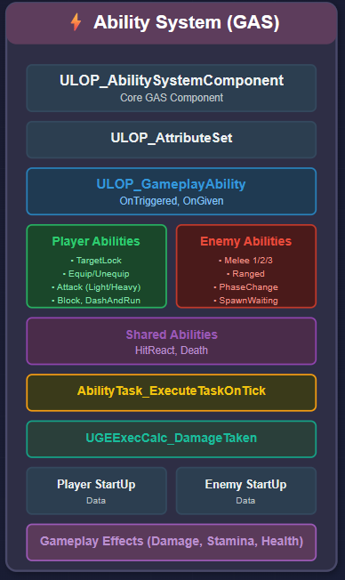

### 📁 Player GA 폴더 구조
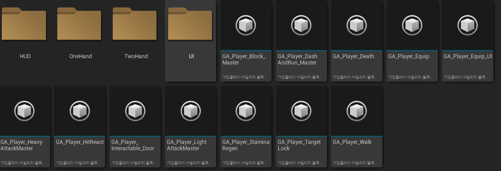

## 🗡 무기 충돌 판정 (Weapon Trace)

> 무기 판정은 단순 Overlap이 아니라  
> Box Sweep 기반으로 구현했습니다.

> 공격 모션 테스트 중, 빠른 공격이나 낮은 프레임 상황에서  
> 프레임 간 위치 변화량이 커 적을 통과하는 문제가 실제로 발생했습니다.  

> Overlap 방식은 프레임 단위로 충돌을 검사하기 때문에  
> 한 프레임 사이 이동 거리가 큰 경우 피격 누락이 발생할 수 있어,  
> 실제 무기 궤적을 기반으로 판정하는 Sweep 방식을 선택했습니다.

> 또한 Sweep Hit Result를 활용하여 타격 위치와 재질 정보를 기반으로  
> 보다 정밀한 히트 판정과 피드백 처리가 가능하도록 구현했습니다.

### 구현 방식

- `SweepMultiByChannel()` 사용
- 이전 프레임 위치와 현재 위치를 보간한 궤적 기반 판정
- HitActor 캐싱으로 중복 타격 방지
- Physical Material 기반 재질별 파티클 분기

> 빠른 공격 모션에서도 피격 누락이 발생하지 않도록  
> 안정적인 타격 판정을 구현하는 데 중점을 두었습니다.

🔗 Combat Component 코드: [[Components/Combat](https://github.com/HaloTwo/LOP/tree/main/Source/LiseOfP/Private/Components/Combat)]

## 🧠 AI 시스템 (BT + EQS + GAS)

> 적 AI는 Behavior Tree 기반으로 구성했습니다.  
> 공격은 플레이어와 동일하게 GameplayAbility를 사용하도록 설계했습니다.

> 단순히 공격 애니메이션을 실행하는 구조가 아니라,  
> AI가 GameplayAbility를 직접 호출하도록 하여  
> 플레이어와 동일한 전투 시스템(GAS)을 공유하도록 구조를 통일했습니다.

### 구성

- Behavior Tree 기반 상태 제어 (탐색 / 추적 / 전투)
- EQS 기반 위치 탐색 및 전투 위치 선정
- 거리 조건 기반 공격 선택 로직
- 쿨다운 + 확률 기반 공격 패턴 분기
- AbilityTag 기반 공격 Ability 실행
- Phase를 DataAsset으로 분리하여 패턴 확장 가능하도록 설계

> 일반 몬스터와 보스 모두 동일한 BT + GAS 구조를 기반으로 동작하며,  
> 보스의 경우 Phase 전환과 패턴 선택 로직을 추가로 확장한 형태로 설계했습니다.  

> 전투 AI는 거리, 상태, 쿨다운, 확률 조건을 종합적으로 판단하여  
> 공격 패턴이 분기되도록 구성했으며,  
> BTTask에서 AbilityTag를 호출하여 공격을 실행하는 구조로 설계했습니다.  

> 이를 통해 코드 수정 없이  
> Ability와 DataAsset 추가만으로 새로운 공격 패턴과 보스 Phase를  
> 확장할 수 있도록 구성했습니다.

Behavior Tree 구조 (일반 몬스터 + 보스 확장 AI)

### 일반 몬스터 BT (기본 전투 AI)
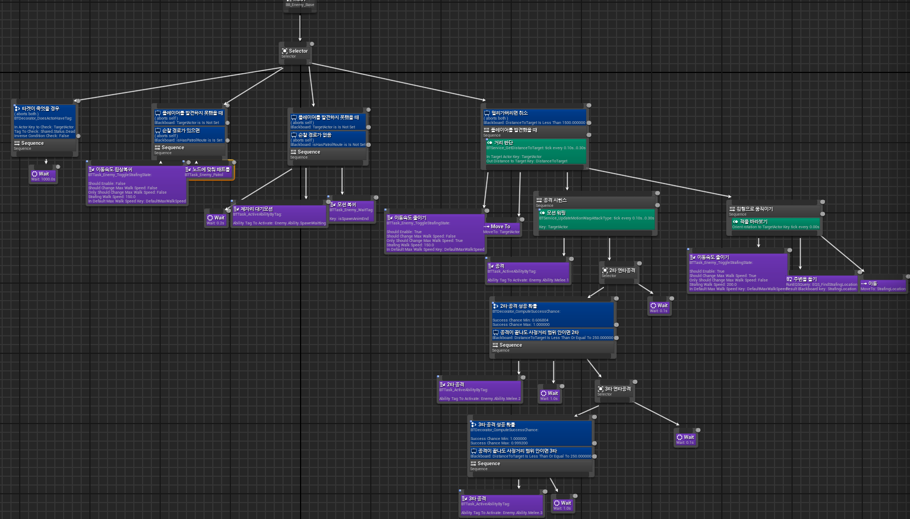

### 보스 BT (Phase + 패턴 확장 구조)
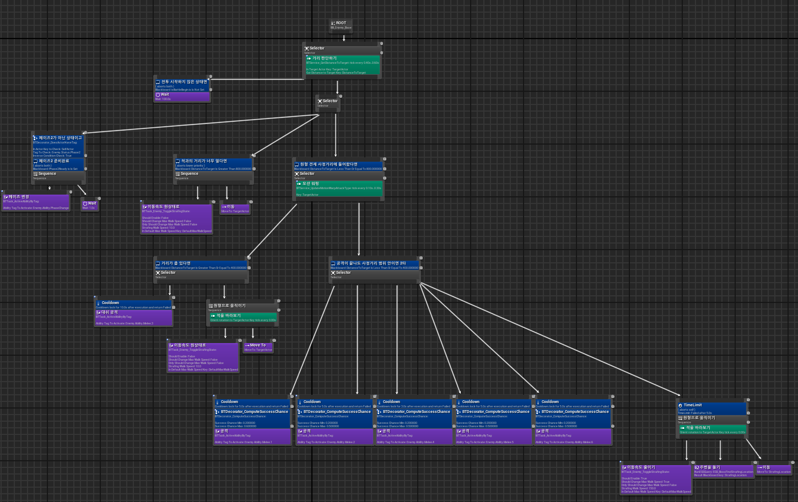

## 🎯 락온 전투 시스템 (Lock-On System)

- Sphere 기반 타겟 탐색 및 후보 선정
- 거리 / 시야각 기반 우선 타겟 선택 로직
- Camera Modifier 기반 대상 방향 회전 보정
- GameplayTag로 Lock-On 상태 관리
- 락온 여부에 따라 이동 / 회피 입력 벡터 분기 처리
- 공격 Ability가 락온 대상 기준으로 실행되도록 타겟 고정

> 단순 카메라 보조 기능이 아닌,  
> 락온 상태에 따라 이동, 대시, 회피, 공격 로직이 함께 변경되는  
> 전투 상태 기반 시스템으로 설계했습니다.

## 🎒 데이터 아키텍처 (Data-Driven Structure)

> 전투, 입력, 무기, Ability 세트 등 핵심 게임플레이 데이터를  
> 코드 하드코딩이 아닌 DataAsset + DataTable 기반으로 관리하는  
> 데이터 중심 구조(Data-Driven)로 설계했습니다.

초기에는 코드에 직접 값을 설정하는 방식으로 구현했으나,  
무기 추가, Ability 변경, 입력 수정 시 코드 수정이 반복되는 문제가 발생하여  
데이터 중심 구조로 리팩토링했습니다.

### 구성

- 무기 데이터 (DA_PlayerWeaponData)
- 플레이어 StartUp Ability 세트 (DA_PlayerData)
- 입력 매핑 (DA_InputConfig + InputTag)
- 아이템 및 UI 데이터 (DataTable)
- Surface Impact VFX 매핑 (Physical Material 기반 DataAsset)

> 무기 변경 시 Weapon DataAsset에 설정된  
> Anim Layer, Ability 세트, 무기 아이콘 등이 자동으로 적용되도록 구성했습니다.  

> 또한 입력 시스템을 InputTag + DataAsset 구조로 분리하여  
> Ability와 입력 바인딩이 코드 의존 없이 확장 가능하도록 설계했습니다.

이를 통해  
- 새로운 무기 추가  
- Ability 세트 변경  
- 입력 키 재바인딩  
- UI 아이콘 교체  
- 타격 재질별 VFX 변경  

과 같은 작업을 코드 수정 없이  
데이터 수정만으로 확장할 수 있도록 구성했습니다.

데이터 구조 - 아이템  /  입력 / 플레이어 / 무기 / VFX

### 🎒 아이템 데이터 테이블 (Item DataTable)
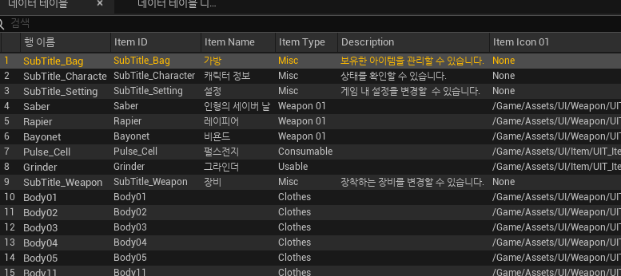

### 🎮 입력 설정 (Input Config)
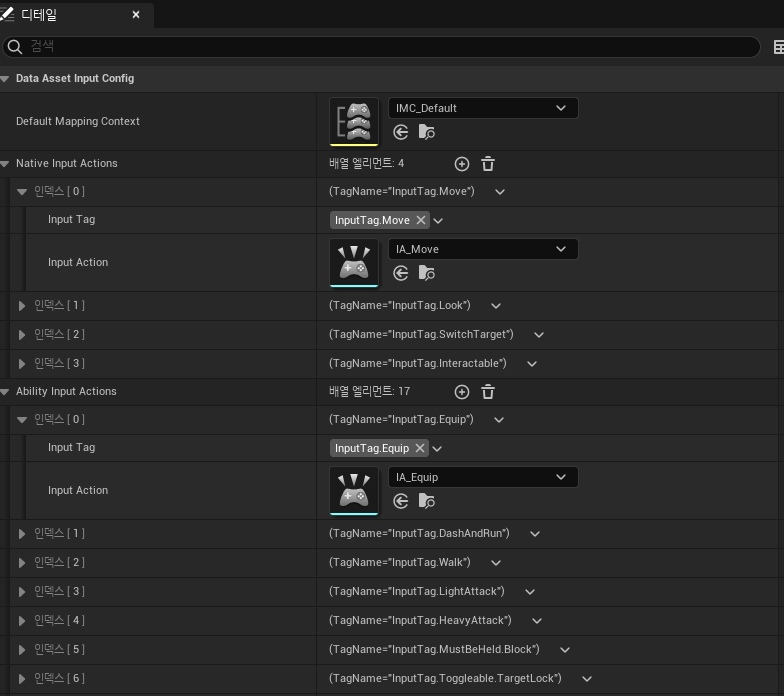

### 👤 플레이어 데이터 (StartUp Ability & Effects)
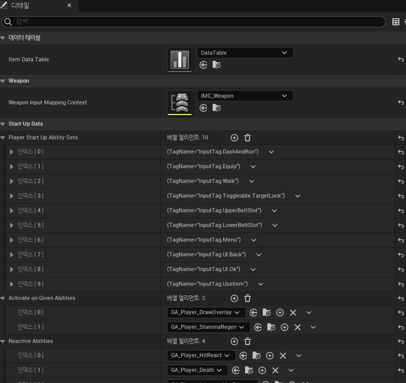

### 🗡 무기 데이터 (Anim Layer + Ability Set)
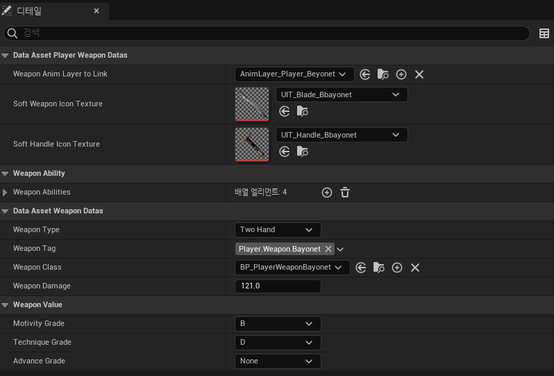

### 💥 타격 VFX 데이터 (Surface Impact VFX DataAsset)
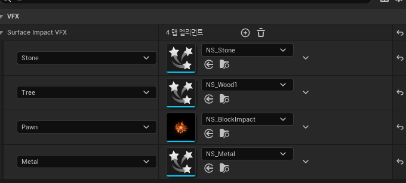

## 🧩 상호작용 시스템 (Interaction System)

> 플레이어가 상호작용 범위에 진입하면 HUD에 입력 프롬프트를 표시하고,  
> 지정된 키 입력 시 Ability를 통해 상호작용을 실행하는 구조로 구현했습니다.

- InteractableBase 부모 클래스를 기반으로 상호작용 객체 공통화
- Overlap 기반 범위 감지로 상호작용 대상 판별
- GameplayTag를 활용한 상호작용 타입 관리
- 입력 시 Interaction Ability 실행 구조
- Delegate를 통해 HUD Prompt 표시 및 제거 처리

> 현재는 보스룸 문(Door Interactable)에 Level Sequence 실행을 적용했으며,  
> 동일한 패턴으로 아이템 획득, 레버, NPC 대화 등  
> 다양한 상호작용 요소로 확장 가능하도록 부모-자식 구조로 설계했습니다.

> 또한 상호작용 로직을 캐릭터에 직접 구현하지 않고  
> Ability 기반으로 분리하여 전투 시스템(GAS)과 구조적 일관성을 유지했습니다.

🔗 InteractableBase.cpp 코드: [[LOP_InteractableBase](https://github.com/HaloTwo/LOP/blob/main/Source/LiseOfP/Private/Items/InteractableBase.cpp)]   

## 🚀 비동기 로딩 & 레벨 전환 (Async Loading)

> 맵 규모로 인한 긴 로딩 시간을 줄이기 위해  
> StreamableManager 기반 비동기 로딩 + Commit 전환 구조를 구현했습니다.

- GameInstance에서 레벨을 GameplayTag로 매핑하여 관리
- RequestAsyncLoad로 레벨 에셋을 선 비동기 로딩
- 로딩 완료 시 Pending Level로만 보관
- 연출 및 입력 종료 시점에 OpenLevel로 실제 전환(Commit)
- UI는 Async Load Progress 값을 활용해 로딩 진행도 표시

> 선로딩 후 전환 시점을 제어하는 구조를 통해  
> 레벨 이동 시 발생하는 끊김을 최소화하고  
> 보다 자연스러운 씬 전환이 가능하도록 설계했습니다.   

🔗 GameInstance.cpp 코드: [[LOP_GameInstance](https://github.com/HaloTwo/LOP/blob/main/Source/LiseOfP/Private/LOP_GameInstance.cpp)]   

## 🛠 프로젝트 최적화 (Optimization)

> 초기 빌드에서는 프레임 저하와 로딩 지연이 크게 발생하여  
> 렌더링 및 씬 전반에 걸쳐 구조적 최적화를 적용했습니다.

- Texture Streaming Pool 조정으로 VRAM 사용량 관리
- Shadow 해상도 및 Cascade 수 감소로 GPU 부하 완화
- Lumen 반사 비활성화로 렌더링 비용 절감
- Early-Z PrePass 및 Occlusion Culling 활성화
- LOD 전환 거리 조정으로 불필요한 드로우콜 감소
- 과도한 Post Process 제거 후 최소 구성 유지

> 최적화 적용 후 빌드 기준 약 40FPS → 100FPS 수준으로 개선되었으며,  
> 플레이 중 프레임 드랍과 로딩 지연을 체감적으로 크게 줄일 수 있었습니다.

---

# 🧪 게임플레이 GIF

GIF 펼치기/닫기

## 1. 🧱 재질별 충돌 파티클 시스템
> 무기 충돌 시 재질(철/목재/석재)에 따라 다른 파티클이 출력되도록 구현

| Material Impact |
|----------------|
|  |

---

## 2. ⚔ 공격 캔슬 & 연속 콤보 시스템
> Anim Notify 기반 공격 캔슬 및 연속 입력 처리 로직 구현

| 1타 공격 | 연속 콤보 |
|----------|-----------|
|  | 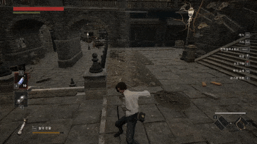 |

---

## 3. 🗡 무기별 공격 판정 & 보정 시스템
> Weapon Trace 기반 무기 타입별 판정 범위 및 타격 보정 처리

| Saber | Rapier | Bayonet |
|-------|--------|---------|
| 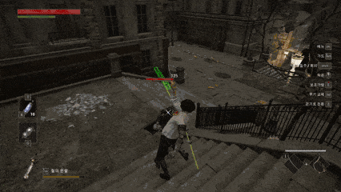 | 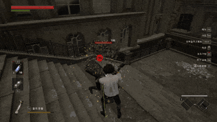 | 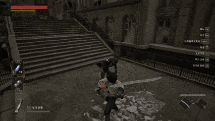 |

---

## 4. 👹 Boss AI & Phase 패턴 시스템
> Behavior Tree 기반 보스 AI 및 Phase 전환 패턴 구현

| Phase 1 | Phase 2 |
|---------|---------|
|  | 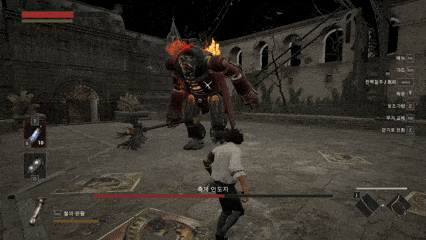 |

| Phase 1 (Variant) | Phase 2 (Variant) |
|-------------------|-------------------|
| 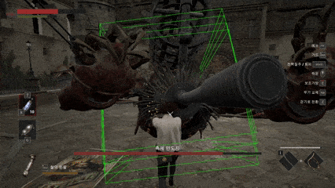 |  |

---

